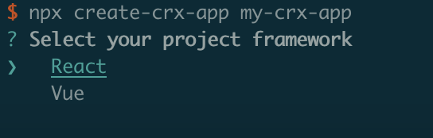
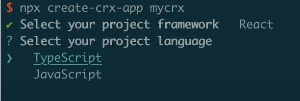

<h1 align="center"><br> </h1>

<h3 align="center">CLI for create Chrome extension app</h3>

English|[简体中文](https://github.com/Jcanno/create-crx-app/blob/main/README-CH.md)

we recommend to type code below in terminal with npm 5.2+ and higher:

```js
npx create-crx-app my-crx-app
cd my-crx-app
npm run dev
```

We can easily generate a Chrome extension project by using create-crx-app step by step.

Select your project framework:



Select your project language:



After that, create-crx-app will generate project by your setting.
